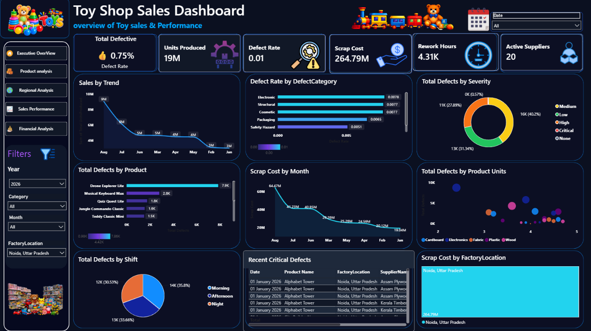
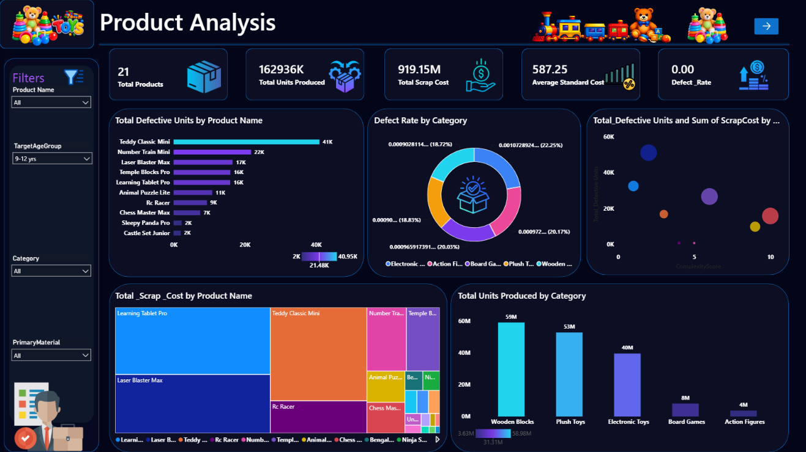
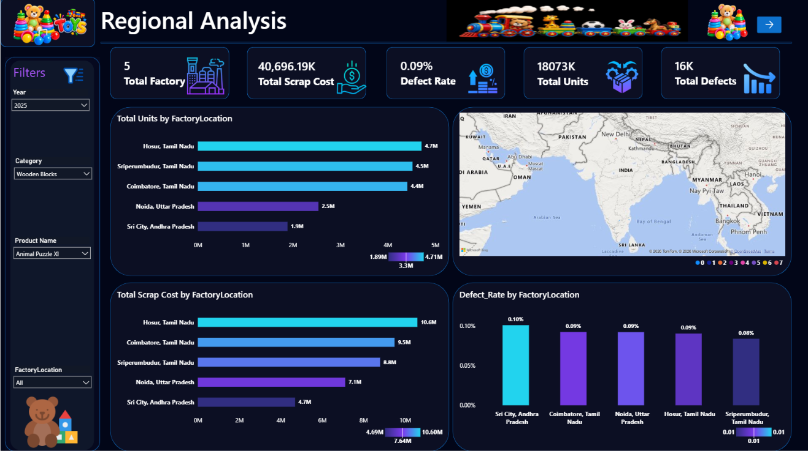
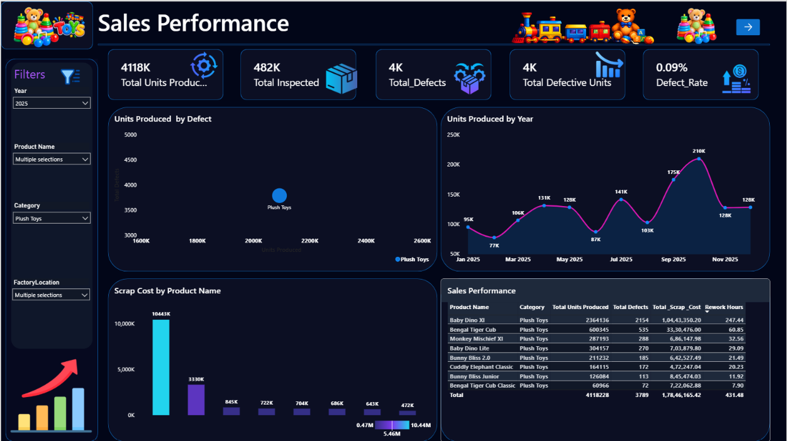
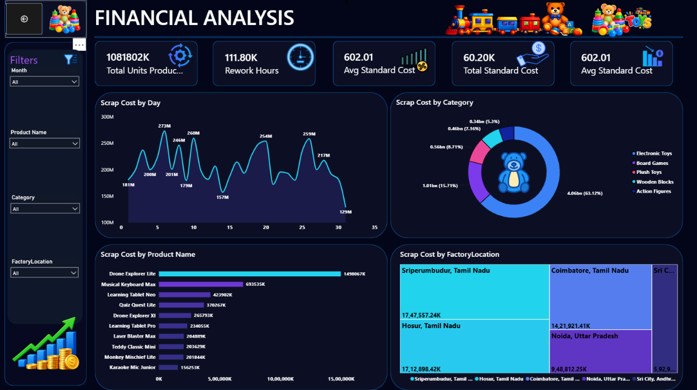

Toy Shop Sales Dashboard

📊 Project Overview

An interactive Power BI dashboard developed to analyze toy manufacturing
sales, production, quality, defects, scrap cost, and operational performance.

🛠️ Tools Used

- Power BI
- DAX
- Excel
- Data Cleaning
- Data Modeling
- Data Visualization

📌 Dashboard Pages

 1. Executive Overview
Overall business and quality performance.
 2. Product Analysis
Product-wise defects, scrap cost, production, and category performance.

 3. Regional Analysis
Factory/location-wise production, scrap cost, and defect rate.

 4. Sales Performance
Production trends, product performance, defects, and inspection metrics.

 5. Financial Analysis
Scrap cost, standard cost, rework hours, and financial performance.

 📈 Key KPIs

 Total Units Produced
 Total Defects
 Defect Rate
 Scrap Cost
 Rework Hours
 Standard Cost
 Total Products
 Total Factories

## 📊 Dashboard Preview

### Executive Overview

### Product Analysis

### Regional Analysis

### Sales Performance

### Financial Analysis

 🔍 Key Insights

- Identified products with higher defective units.
- Compared defect rates across categories.
- Analyzed factory-wise scrap costs.
- Tracked production trends over time.
- Evaluated operational and financial KPIs.
 👨‍💻 Author

EASAKI RAJA B

Data Analyst | Power BI | Excel | SQL | Python
